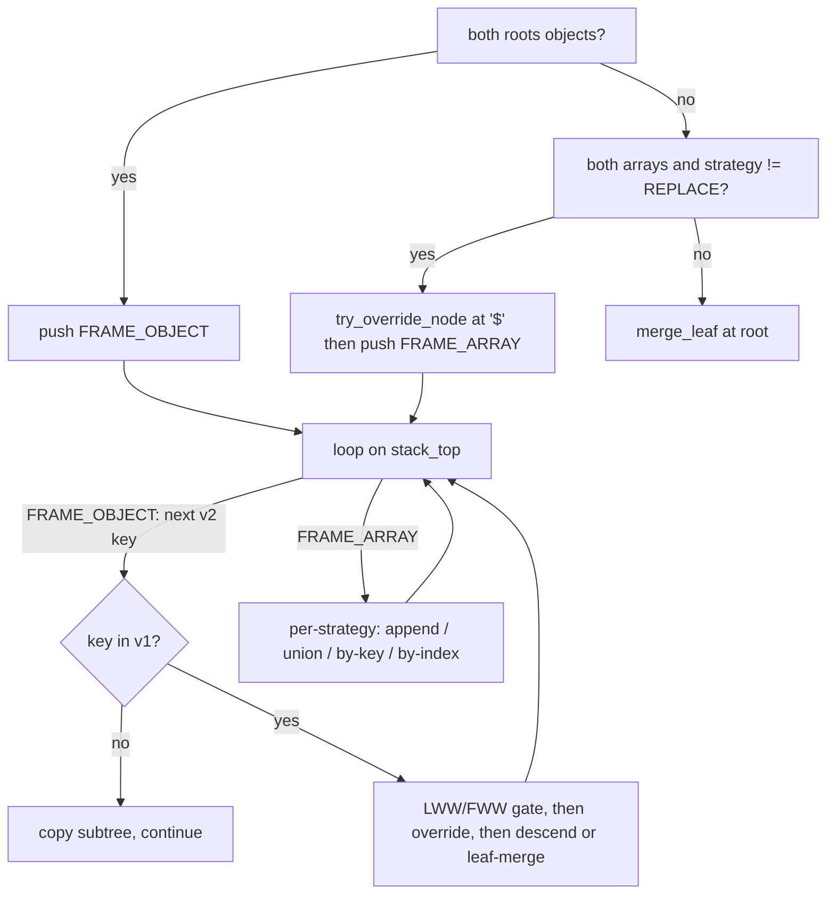

# Architecture

How opto-sync is put together, and why the pieces are split where they are.
This document is for someone evaluating the engine or about to extend it. It
describes *mechanism*; the observable merge contract is
[MERGE_SEMANTICS.md](./MERGE_SEMANTICS.md) and the versioning/ABI rules are
[COMPATIBILITY.md](./COMPATIBILITY.md). Measured costs are in
[PERFORMANCE.md](./PERFORMANCE.md).

## 1. Layers

```
                      ../opto-sync-e2e
   servers        rust-mash · rust-fullstack · node · dart · sagitta
   (HTTP, SQL, CAS retry, tombstones, batch replay)
                              |
                      ../opto-sync-clients
   clients        clients/ts (Dexie/IndexedDB) · clients/dart (Drift/SQLite) · clients/rust
   (offline queue, local store, transport, reconcile policy)
                              |
                        syncer.c/plugins
   ORM glue       drizzle · kysely · typeorm · prisma · diesel · sqlx · seaorm · gorm · ecto
   (read the column as text, call the core, write the result back)
                              |
                        syncer.c/bindings
   bindings       typescript (N-API) · wasm · dart (FFI) · rust · go (cgo) · beam (Rustler)
   (marshalling only: strings in, string out, options struct or flat args)
                              |
                          syncer.c/core
   engine         core/src/syncer.c + vendored core/src/yyjson.c
   (ALL merge semantics: strategies, LWW/FWW, identity matching, paths)
```

| Layer | Path | Owns | Must not own |
|---|---|---|---|
| core | `core/` | every merge rule, path construction, dedup, identity matching | I/O, clocks, schema knowledge |
| bindings | `bindings/` | string/option marshalling, callback trampolines, memory handoff | any merge decision |
| plugins | `plugins/` | getting raw JSON out of and back into an ORM/driver | any merge decision |
| clients | `../opto-sync-clients` | offline queue, local storage, transport, default policy | any merge decision |
| servers | `../opto-sync-e2e/servers` | HTTP, compare-and-set, tombstones, batch replay | any merge decision |

### The rule: merge semantics exist only in the core

Every layer above the core reduces to "hand two JSON strings to
`syncer_merge_json_ex` and use what comes back". Three things hold that line:

- **`test-differential/`** merges 305 document pairs (`corpus.jsonl`) through C,
  TypeScript, Dart, Rust and Go and requires **byte-identical** output, plus a
  second per-language idempotency pass. A binding that reimplemented any rule
  fails immediately.
- **The client engine seam.** `opto-sync-clients/clients/ts/src/engine.ts`
  defines a two-method `MergeEngine` interface (`mergeJson`, `version`) and
  registers either the N-API addon or the wasm build behind it;
  `reconcile-core.ts` imports no engine at all. There is no second code path to
  drift.
- **Strategy enum values are a wire contract.** `REPLACE=0 … MERGE_BY_KEY=4`
  are duplicated in the bindings and clients as constants (not re-derived), and
  `clients/ts/test/engine-parity.test.mjs` asserts the map matches both engines.

One deliberate exception exists in the tree: the Node e2e server contains a
dev-only `jsDeepMerge` fallback (`opto-sync-e2e/servers/node/src/index.ts`) for
running locally without a compiled addon. It is not a semantics implementation —
`SYNCER_REQUIRE_NATIVE=1` makes the server refuse to start rather than use it,
precisely so a passing suite cannot mean "the core was never called".

## 2. Zero-deserialization data flow

"Zero-deserialization" means **zero host-language deserialization**. The core
still parses: yyjson builds a value tree, the merge runs over it, and yyjson
writes text back out. What disappears is the host's own object graph.

```
  Postgres jsonb column
        |  SELECT data::text            <- driver hands back TEXT, not objects
        v
  "{\"items\":[...]}"  ---------+
                                |   binding copies the bytes across the FFI
  incoming request body  -------+   boundary (no host-side parse)
        v
  +---------------------------------------------------+
  |  core:  yyjson_read(json1)  yyjson_read(json2)    |
  |         yyjson_doc_mut_copy(doc1)  -> mutable v1  |
  |         do_merge(v1, v2, opts)                    |
  |         yyjson_mut_write(mut_doc)  -> char*       |
  +---------------------------------------------------+
        v
  "{\"items\":[...]}"
        |  UPDATE ... SET data = $1::jsonb   <- written straight back as text
        |  and/or JSON.parse(merged) ONCE if the host needs objects
        v
```

`syncer_merge_json_ex` (`core/src/syncer.c:980`) is exactly that sequence:
parse both sides, `yyjson_doc_mut_copy` the base into a mutable document, merge
`v2` into it in place, serialize once, free everything.

What it buys, concretely:

| Benefit | Why |
|---|---|
| One parse + one write per merge, in C | The host would otherwise parse both sides, merge, and re-serialize — and the core would parse again anyway. |
| No 2^53 damage to untouched fields | `{"a":1689940800123456789}` merges to `{"a":1689940800123456789,...}` byte-exact (verified against the core directly). A JS host that never `JSON.parse`es the result cannot round it. See COMPATIBILITY.md for the limits of this. |
| The merged text is directly storable | `$1::jsonb` takes the string as-is; no stringify -> parse -> stringify round trip. `plugins/typescript/drizzle/index.ts` passes a string through `toDriver` verbatim for this reason. |
| Identical bytes on every runtime | The differential suite can compare text because text is what every layer handles. |

### Where it does NOT apply

- **The Prisma plugin is not zero-deserialization.** `plugins/typescript/prisma/index.ts`
  reads through `findUnique`, and Prisma's model API deserializes `jsonb` to a
  JS object; the plugin has to `JSON.stringify` it back before merging and
  `JSON.parse` the result because Prisma's `update` takes a value, not raw SQL.
  Its own source says so at the `findUnique` call. The trade is deliberate:
  Prisma-native ergonomics instead of raw text. Consequence: any number in that
  document has been through a JS double, so the 2^53 caveat applies to the
  *whole* document, not just the fields the caller touched.
  The `kysely` and `typeorm` plugins project `<column>::text` and keep the raw
  path; `gorm` reads the column into bytes.
- **Any host that needs native objects** deserializes once, at the end — that
  is the design (`performZeroDeserializationMerge` in the drizzle plugin ends
  with a single `JSON.parse`).
- **Override callbacks reintroduce serialization.** For every node it consults,
  the core serializes both sides (`yyjson_mut_val_write` / `yyjson_val_write`),
  hands the host two strings, and parses whatever comes back. The TypeScript
  adapter (`bindings/typescript/BaseMergeStrategy.ts`) then `JSON.parse`s both.
  A callback that fires on a large subtree is the most expensive thing the
  engine can do.
- **Postgres normalization.** jsonb re-orders object keys and drops duplicates,
  so a round trip is semantically stable but never byte-stable (COMPATIBILITY.md).
  Compare parsed values across a jsonb round trip, not text.

## 3. Engine internals

All of this lives in `core/src/syncer.c`. Public surface:
`syncer_merge_json_ex`, the legacy `syncer_merge_json`, `syncer_free`,
`syncer_version`, and the `static inline syncer_default_options()` in
`core/include/syncer.h`.

### 3.1 Iterative DFS over an explicit heap stack

The merge is a depth-first traversal driven by a heap-allocated stack of frames
instead of C recursion:

```c
typedef enum { FRAME_OBJECT, FRAME_ARRAY } frame_kind_t;

typedef struct {
    frame_kind_t    kind;
    yyjson_mut_val* v1;         /* mutable destination (the base copy) */
    yyjson_val*     v2;         /* immutable source (the incoming doc) */
    yyjson_obj_iter obj_iter;   /* FRAME_OBJECT: position in v2's keys   */
    size_t          arr_idx;    /* FRAME_ARRAY:  next v2 index to handle */
    size_t          arr_len_v2;
    size_t          path_saved; /* path length to restore on pop        */
} merge_frame_t;                /* merge_stack_t = {frames, count, cap, oom} */
```

`do_merge` seeds one frame (object-vs-object at the root, or array-vs-array at
the root under a non-`REPLACE` strategy) and then loops on `stack_top()` until
the stack empties. `FRAME_OBJECT` pulls **one key** per iteration from
`v2` via `yyjson_obj_iter_next`; `FRAME_ARRAY` under `MERGE_BY_KEY` /
`MERGE_BY_INDEX` handles **one element** per iteration and stores its cursor in
`arr_idx`, so a matched object pair can be pushed as a child `FRAME_OBJECT` and
resumed exactly where it left off when that child pops. `APPEND` and `UNION`
drain the whole array in one visit and pop immediately, because neither
descends.



**Why not recursion.** Depth is attacker- and data-controlled: a jsonb column
can nest as deeply as the writer likes, and a merge that recursed would fault
the C stack (or the much smaller wasm stack) on a document that parses fine.
`core/test/test_syncer.c:test_extreme_depth` merges two 1000-level documents to
pin this. The same reasoning applies to structural comparison, which is why
`vals_deep_equal` carries its own stack rather than recursing (§3.4). Depth
therefore costs heap, not stack, and `max_depth` remains a *policy* knob (stop
merging and replace the subtree) rather than a safety valve.

### 3.2 The path buffer

`path_buf_t` is a doubling `char` buffer seeded with `"$"`. Descending appends
(`path_push_key`, `path_push_index`); every frame records `path_saved` and
`path_restore` truncates back to it on pop, so the buffer is built once and
rewound rather than reallocated per node.

Two details worth knowing:

- `path_push_key` takes an **explicit length**, because a JSON key may contain
  an escaped NUL. The `const char*` the callback receives still appears
  truncated at such a NUL — unavoidable with that signature — but the buffer's
  own accounting stays correct, so keys appended *after* that segment are not
  lost.
- Under `MERGE_BY_KEY` the index in the path is the matched element's index in
  the **base** array (`idx1` from `find_by_ident`), not its position in the
  incoming array. Verified: merging `arr` matched on `id` yields paths like
  `$.arr[0].q`.

### 3.3 Visited-pair set (circular references)

Optional, `opts.detect_circular_refs`. `visited_set_t` is a flat array of
`(uintptr_t v1, uintptr_t v2)` pairs; before descending into a pair the engine
checks `visited_contains` (a linear scan) and skips the subtree on a hit. This
exists for callers that build yyjson values programmatically and can create a
cycle — text parsed by `yyjson_read` cannot contain one — which is why it is off
by default. The scan is linear in pairs already visited, so enabling it makes a
merge quadratic in the number of merged container nodes; PERFORMANCE.md measures
the cost.

### 3.4 Structural deep equality (`vals_deep_equal`)

`UNION` needs to answer "is this incoming element already present?".
The obvious implementation — serialize both sides and `strcmp` — is what the
core did before 0.2.1, and it is wrong for the primary use case: **Postgres
jsonb renormalizes object key order on every write**, so a stored
`{"v":3,"id":"c"}` would not match an incoming `{"id":"c","v":3}`, `UNION`
would silently degrade to `APPEND`, and idempotency (which MERGE_SEMANTICS.md
promises for `UNION`) would be lost.

`vals_deep_equal` compares across the immutable/mutable APIs with an explicit
`eq_stack_t` of `(yyjson_mut_val*, yyjson_val*)` pairs:

| Node kind | Rule |
|---|---|
| objects | size must match, then every key of `b` must exist in `a` (`yyjson_mut_obj_getn`) and its value must match — **key order irrelevant** |
| arrays | size must match and elements compare **positionally** — order is meaningful |
| numbers | int-vs-int compares exactly as `int64`; any pair involving a real compares as `double` (so `1` and `1.0` are the same element) |
| strings / bools / null | direct comparison |
| anything else | not equal |

`array_contains` runs it against each base element in turn — hence the O(n*m)
term measured in PERFORMANCE.md. On allocation failure the comparator reports
"not equal", which for `UNION` means an element may be appended twice:
degraded, never corrupt.

The same fallback path is used by `MERGE_BY_KEY` for elements that are not
objects or that carry none of the identity keys.

### 3.5 Identity matching (`MERGE_BY_KEY`)

Three functions, in call order:

1. `ident_key_of(elem, match_keys, ...)` — walks the comma-separated
   `array_match_keys` list in place (no fixed-size copy, spaces trimmed) and
   returns the value of the **first listed key the incoming element actually
   carries**, plus that key's name and length. First-present-wins keeps matching
   deterministic: a weaker later key cannot rescue a missing match on a stronger
   earlier one.
2. `find_by_ident(arr1, key, keylen, ident, &idx1)` — linear scan of the base
   array for an element whose value at that key matches. First match wins.
3. `ident_values_equal(a, b)` — int-vs-int exact, string-vs-string `strcmp`,
   int-vs-string normalized through a 24-byte buffer (`42` matches `"42"`), and
   any other type combination falls back to serializing both sides and
   comparing text.

A match then passes through the per-element LWW/FWW gate
(`should_reject_by_crdt_rules`) before being pushed as a child `FRAME_OBJECT`;
no match appends a copy.

### 3.6 Timestamp resolution

`should_reject_by_crdt_rules` -> `check_crdt_keys` (once for `fww_keys` with
`is_fww=true`, once for `lww_keys`) -> `ts_compare` for the string cases. The
key list is walked in place, a key participates only when **both** sides carry
it, and rejection is all-or-nothing for the node. `ts_compare` strips leading
zeros and compares pure-digit strings by magnitude so `"10" > "9"`; everything
else is lexicographic. The observable contract, including which comparisons are
chronologically meaningful, is in MERGE_SEMANTICS.md.

Defaults are applied inside `do_merge`, not by the caller: `lww_keys` defaults
to `"updatedAt"`, `array_match_keys` to `"id"`, `fww_keys` to `NULL`. A `NULL`
pointer and an empty string are therefore **different requests** — `""` means
"no keys at all" — and every binding preserves that distinction.

### 3.7 Out-of-memory discipline

Each growable structure carries an `oom` flag and, on realloc failure, keeps its
previous contents rather than losing them:

| Structure | On allocation failure |
|---|---|
| `path_buf_t` | sets `oom`; keeps the old buffer (freed in `path_free`); all pushes become no-ops |
| `merge_stack_t` | `stack_push` returns `NULL`; `do_merge` sets `ok = false` and breaks |
| `visited_set_t` | sets `oom`; the loop checks it each iteration and aborts |
| `eq_stack_t` (`vals_deep_equal`) | reports "not equal" — degraded dedup, not an abort |

`do_merge` returns `false` if any flag is set, and `syncer_merge_json_ex` then
skips serialization entirely and returns `NULL`. **A partial document is never
emitted**, and `NULL` never means "empty" — every binding surfaces it as
`null`/`None`/`{:error, _}`/an exception.

Scope, precisely: this covers the engine's own three heap structures. yyjson's
internal allocations on the copy/insert path are not individually checked — the
return values of `yyjson_mut_obj_add`, `yyjson_mut_obj_put`,
`yyjson_mut_arr_append` and `yyjson_val_mut_copy` are not inspected at those
call sites, and yyjson's `..._obj_put` with a `NULL` value *removes* the key. So
a yyjson allocation failure mid-merge would show up as a dropped key rather than
a `NULL` return. The pre-flight failures that are checked — `yyjson_read` of
either side, `yyjson_doc_mut_copy` of the base, `path_init` on the leaf path —
all return `NULL` correctly.

### 3.8 Length-explicit key handling

RFC 8259 allows `""` inside a string, so a JSON key can contain an
embedded NUL. Every key operation in the engine takes an explicit length —
`yyjson_get_len(k2)` feeding `yyjson_mut_obj_getn`, `yyjson_mut_strn`,
`yyjson_mut_obj_add/put` — because a `strlen`-based lookup truncates at the NUL,
aliases the incoming key onto an unrelated shorter key, overwrites it *and*
drops the real one. Verified: merging `{"ab":1,"a":2}` with
`{"ab":3}` yields `{"ab":3,"a":2}` — both keys intact.

### 3.9 The legacy API

`syncer_merge_json(json1, json2, cb)` wraps the extended API. Its old callback
signature received only the immediate key, so `legacy_cb_adapter` extracts the
last path segment and forwards. The user callback is parked in a
`static __thread syncer_merge_override_cb` and cleared on return — thread-local,
so concurrent callers do not clobber each other, and it is the **only** mutable
state in the core. The `_ex` path touches none of it, which is what makes
concurrent merges trivially safe (§5).

## 4. Override callbacks

Two entry points consult `opts.override_cb`:

- `try_override_node(doc, opts, path, v1, v2)` — for **container** nodes, before
  the strategy descends. Returning `NULL` (declining, no callback, or a return
  value that does not parse) falls through to the normal merge, so a bad return
  cannot drop `v2`'s subtree.
- `merge_leaf(doc, path, v1, v2, opts)` — for leaves: scalars, type mismatches,
  arrays under `REPLACE`, and any node reached at the `max_depth` limit.
  Declining means "`v2` overwrites `v1`".

Which nodes actually reach a callback (verified empirically by declining every
call and logging the paths):

| Situation | Consulted | Via |
|---|---|---|
| root object pair | no (the root itself is never offered) | — |
| root array pair, strategy != `REPLACE` | yes, at path `$` | `try_override_node` |
| root array pair, `REPLACE`, or root scalar/type mismatch | yes, at path `$` | `merge_leaf` |
| both sides objects at a key | yes, before descending | `try_override_node` |
| both sides arrays at a key, strategy != `REPLACE` | yes, before descending | `try_override_node` |
| both sides arrays at a key, `REPLACE` | yes (as a leaf) | `merge_leaf` |
| scalars, or mismatched types | yes | `merge_leaf` |
| node at the `max_depth` limit | yes | `merge_leaf` |
| key present only in incoming | no — copied verbatim | — |
| element appended by `APPEND`/`UNION`/unmatched `MERGE_BY_KEY` | no | — |
| **matched object element** under `MERGE_BY_KEY`/`MERGE_BY_INDEX` | **no** — the element node itself is pushed straight as a frame; its keys and nested containers are consulted normally (`$.arr[0].q`) | — |
| node rejected by LWW/FWW | no — the gate runs before `try_override_node` | — |

The second-to-last row is a real asymmetry: under `MERGE_BY_INDEX` a *scalar*
element (`$.s[0]`) is offered but an *object* element (`$.arr[0]`) is not.
MERGE_SEMANTICS.md's summary ("every node where both sides are present") reads
slightly stronger than the code on this point.

### Ownership contract

```
core                                        host callback
----                                        -------------
s1 = yyjson_mut_val_write(v1)   malloc'd by yyjson
s2 = yyjson_val_write(v2)       malloc'd by yyjson
                     ---- (path, s1, s2) --->   borrowed, valid for the call only
                     <---- res or NULL -----    res must be malloc'd, ownership transfers
free(s1); free(s2)
yyjson_read(res) -> copy into doc; free(res)
```

- The core `free()`s the returned pointer, so it must come from `malloc` (a
  string literal or a stack buffer is a bug). The wasm wrapper allocates it with
  `_malloc` and deliberately does not track it for cleanup, exactly because
  ownership moves.
- `path`, `s1` and `s2` are owned by the core and are freed as soon as the
  callback returns — a host must copy anything it wants to keep.
- If either serialization fails, the callback is **not** invoked (it is never
  handed a `NULL` string).
- A return value that does not parse is freed and treated as a decline.
- Bindings that re-enter a managed runtime here must survive a host exception
  without leaking the core's in-flight allocations. The wasm wrapper remembers
  the first throw, returns 0 for the rest of the merge, and rethrows after the
  merge unwinds; Rust, Go and BEAM omit callbacks entirely (COMPATIBILITY.md).

## 5. Concurrency and purity

A merge is a pure function of `(json1, json2, opts)`: no clock, no I/O, no
global state (the one `__thread` slot belongs to the legacy callback API). Each
call allocates its own documents and stacks. Concurrent merges on separate
threads are therefore safe with no locking, and each binding pins this with its
own suite — `bindings/go/concurrency_test.go` (run under `-race`),
`bindings/rust/tests/concurrency.rs` (threads hammering shared inputs, plus the
legacy path), `bindings/typescript/test-concurrency.js` (8 `worker_threads` x
200 merges, plus a reentrancy case where an override callback calls `mergeJson`
again). PERFORMANCE.md covers what that means for throughput.

## 6. Adding a binding

Follow the WebAssembly binding, not the struct-mirroring ones.
`bindings/wasm/src/syncer_wasm.c` exposes **flat scalar arguments** and builds
the options struct in C:

```c
EMSCRIPTEN_KEEPALIVE
char* syncer_merge_flat_cb(const char* j1, const char* j2,
                           int strategy, unsigned max_depth,
                           int detect_circular, int resolve_ts,
                           const char* lww, const char* fww, const char* match,
                           syncer_merge_override_cb_ex cb)
{
    if (!j1 || !j2) return NULL;
    syncer_merge_options_t opts = syncer_default_options();   /* core initializes every field */
    opts.array_strategy = (syncer_array_strategy_t)strategy;
    /* ... only what the caller asked for ... */
    return syncer_merge_json_ex(j1, j2, &opts);
}
```

Why this is preferable to mirroring `syncer_merge_options_t` in the host
language:

- **Struct layout is a compiler decision.** The struct mixes a function
  pointer, an enum, a `uint32_t`, two `bool`s and three `const char*`s; offsets
  and tail padding differ by target (notably `wasm32`, where pointers are 4
  bytes). A mirror that is right on one target can be wrong on another.
- **The struct has already grown once.** `array_match_keys` arrived in 0.2.0 and
  every mirror had to change in lockstep. COMPATIBILITY.md records that the
  Dart and Rust bindings are ABI-sensitive for exactly this reason.
- **The failure mode is silent.** A mirror one field short does not crash; it
  feeds the core a garbage `lww_keys` pointer and merges *wrongly*. Flat
  arguments turn an ABI hazard into a compile error.
- **Starting from `syncer_default_options()` future-proofs the shim.** Any field
  added later is initialized by the core's own header, so a new core option
  defaults sanely in a binding that has never heard of it.

A checklist for a new binding:

1. A C shim with flat arguments, exporting `syncer_merge_flat`-style entry
   points plus `syncer_free` and `syncer_version`. Do not export
   `syncer_merge_json_ex` to the host if you can avoid it — the wasm build
   deliberately does not.
2. Preserve `NULL` vs `""` for `lww_keys` / `fww_keys` / `array_match_keys`
   (§3.6). Absent option -> null pointer; explicit empty string -> pointer to
   `""`.
3. Return `null`/`None`/an error for a `NULL` result — never `""`, never a
   silent empty document.
4. Free the returned string with `syncer_free` on every path, including when the
   host throws.
5. Expose `syncer_version()` so a consumer can detect a stale library
   (COMPATIBILITY.md, "stale-artifact hazard" — node-gyp and Go's build cache
   both fail to notice changed core sources).
6. If you expose callbacks: `malloc` the returned string, tolerate a host
   exception without leaking, and clean up any function-table slot you added.
7. Register the binding in `test-differential/run_all.sh` and make its output
   byte-identical to the C runner's before claiming support.

## 7. Not in the core, on purpose

Transport, retry, storage, tombstones, auth, schema, and "when to sync" are all
above the core. The engine takes two strings and returns one. The only knobs are
the seven fields of `syncer_merge_options_t`, and adding one is an ABI event —
read COMPATIBILITY.md first.
